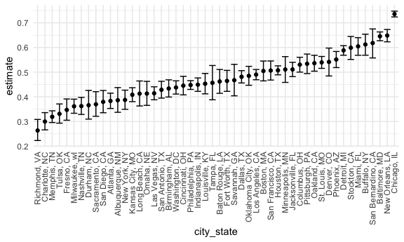

Homework 5 Solutions
================
Meghan Bellerose
November 7, 2020

    ## ── Attaching packages ─────────────────────────────────────── tidyverse 1.3.0 ──

    ## ✓ ggplot2 3.3.2     ✓ purrr   0.3.4
    ## ✓ tibble  3.0.4     ✓ dplyr   1.0.2
    ## ✓ tidyr   1.1.2     ✓ stringr 1.4.0
    ## ✓ readr   1.3.1     ✓ forcats 0.5.0

    ## ── Conflicts ────────────────────────────────────────── tidyverse_conflicts() ──
    ## x dplyr::filter() masks stats::filter()
    ## x dplyr::lag()    masks stats::lag()

# Problem 1

The data for this problem were compiled by *The Washington Post* and
include information on more than 52,000 criminal homicides that occurred
over the past decade in 50 major U.S. cities.

``` r
homicides = 
  read_csv("./hom_data/homicide_data.csv")
```

    ## Parsed with column specification:
    ## cols(
    ##   uid = col_character(),
    ##   reported_date = col_double(),
    ##   victim_last = col_character(),
    ##   victim_first = col_character(),
    ##   victim_race = col_character(),
    ##   victim_age = col_character(),
    ##   victim_sex = col_character(),
    ##   city = col_character(),
    ##   state = col_character(),
    ##   lat = col_double(),
    ##   lon = col_double(),
    ##   disposition = col_character()
    ## )

The dataset contains 52179 rows and 12 columns, with each row
representing a single homicide. The variables are location of a homicide
(latitude and longitude), whether an arrest was made, and demographic
information about the victim.

The following code chunks create a `city_state` variable and provide a
table of the number of unresolved homicides and total number of
homicides by city.

``` r
homicide_df =
  homicides %>% 
  mutate(
    resolved = case_when(
      disposition == "Closed without arrest" ~ "unsolved",
      disposition == "Open/No arrest" ~ "unsolved",
      disposition == "Closed by arrest" ~ "solved",
    )
  ) %>% 
  unite("city_state", city:state, sep = ", ", remove = TRUE) %>% 
  select(city_state, resolved) %>% 
  filter(city_state !="Tulsa, AL")
```

``` r
aggregate_df = 
  homicide_df %>% 
  group_by(city_state) %>% 
  summarize(
    hom_total = n(),
    hom_unsolved = sum(resolved == "unsolved")
  )
```

    ## `summarise()` ungrouping output (override with `.groups` argument)

Try a proportion test for Boston, MA

``` r
prop.test(
  310, 
  614)
```

    ## 
    ##  1-sample proportions test with continuity correction
    ## 
    ## data:  310 out of 614, null probability 0.5
    ## X-squared = 0.040717, df = 1, p-value = 0.8401
    ## alternative hypothesis: true p is not equal to 0.5
    ## 95 percent confidence interval:
    ##  0.4646219 0.5450881
    ## sample estimates:
    ##        p 
    ## 0.504886

Prepare for iteration

``` r
prop.test(
    aggregate_df %>%  filter(city_state == "Boston, MA") %>%  pull(hom_unsolved),
    aggregate_df %>%  filter(city_state == "Boston, MA") %>%  pull(hom_total)) %>% 
  broom::tidy()
```

    ## # A tibble: 1 x 8
    ##   estimate statistic p.value parameter conf.low conf.high method     alternative
    ##      <dbl>     <dbl>   <dbl>     <int>    <dbl>     <dbl> <chr>      <chr>      
    ## 1    0.505    0.0407   0.840         1    0.465     0.545 1-sample … two.sided

Iteration

``` r
results_df = 
  aggregate_df %>% 
  mutate(
    prop_tests = map2(.x = hom_unsolved, .y = hom_total, ~prop.test(x = .x, n = .y)),
    tidy_tests = map(.x = prop_tests, ~broom::tidy(.x))
  ) %>% 
  select(-prop_tests) %>% 
  unnest(tidy_tests) %>% 
  select(city_state, estimate, conf.low, conf.high)
```

``` r
results_df %>% 
  mutate(city_state = fct_reorder(city_state, estimate)) %>% 
  ggplot(aes(x = city_state, y = estimate)) +
  geom_point() +
  geom_errorbar(aes(ymin = conf.low, ymax = conf.high)) +
  theme(axis.text.x = element_text(angle = 90, vjust = 0.5, hjust =1))
```



# Probelem 2

This problem uses data from a longitudunal study with a control and
experimental arm.

First, I’ll create a tidy dataframe with the participants’ subject IDs,
study arms, and observations over time.

``` r
study_df = 
  list.files("./data")
```

Use purrr:map and save each result as new variable in dataframe

# Problem 3
