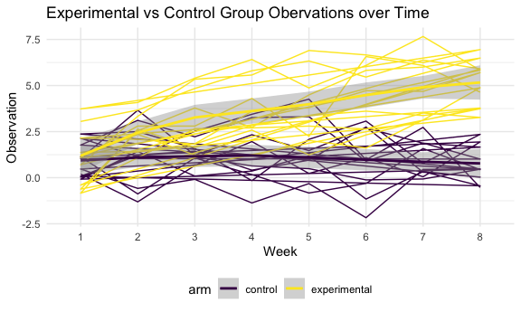
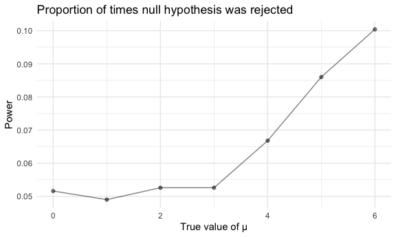
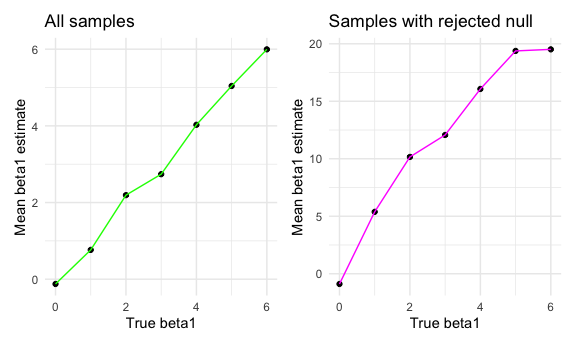

Homework 5 Solutions
================
Meghan Bellerose
November 7, 2020

``` r
library(tidyverse)
```

    ## ── Attaching packages ─────────────────────────────────────── tidyverse 1.3.0 ──

    ## ✓ ggplot2 3.3.2     ✓ purrr   0.3.4
    ## ✓ tibble  3.0.4     ✓ dplyr   1.0.2
    ## ✓ tidyr   1.1.2     ✓ stringr 1.4.0
    ## ✓ readr   1.3.1     ✓ forcats 0.5.0

    ## ── Conflicts ────────────────────────────────────────── tidyverse_conflicts() ──
    ## x dplyr::filter() masks stats::filter()
    ## x dplyr::lag()    masks stats::lag()

``` r
library(broom)
library(ggplot2)
library(patchwork)

knitr::opts_chunk$set(
  fig.width = 6,
  fig.asp = .6,
  out.width = "90%"
)

theme_set(theme_minimal() + theme(legend.position = "bottom"))

options(
  ggplot2.continuous.colour = "viridis",
  ggplot2.continuous.fill = "viridis"
)

scale_colour_discrete = scale_colour_viridis_d
scale_fill_discrete = scale_fill_viridis_d
```

# Problem 1

The data for this problem were compiled by *The Washington Post* and
include information on more than 52,000 criminal homicides that occurred
over the past decade in 50 major U.S. cities.

``` r
homicides = 
  read_csv("./hom_data/homicide_data.csv")
```

    ## Parsed with column specification:
    ## cols(
    ##   uid = col_character(),
    ##   reported_date = col_double(),
    ##   victim_last = col_character(),
    ##   victim_first = col_character(),
    ##   victim_race = col_character(),
    ##   victim_age = col_character(),
    ##   victim_sex = col_character(),
    ##   city = col_character(),
    ##   state = col_character(),
    ##   lat = col_double(),
    ##   lon = col_double(),
    ##   disposition = col_character()
    ## )

The dataset contains 52179 rows and 12 columns, with each row
representing a single homicide. The variables are location of a homicide
(latitude and longitude), whether an arrest was made, and demographic
information about the victim.

The following code chunks create a `city_state` variable and provide the
proportion of unsolved homicides (number of unresolved homicides / total
number of homicides) by city.

``` r
homicide_df =
  homicides %>% 
  mutate(
    resolved = case_when(
      disposition == "Closed without arrest" ~ "unsolved",
      disposition == "Open/No arrest" ~ "unsolved",
      disposition == "Closed by arrest" ~ "solved",
    )
  ) %>% 
  unite("city_state", city:state, sep = ", ", remove = TRUE) %>% 
  select(city_state, resolved) %>% 
  filter(city_state !="Tulsa, AL")
```

``` r
aggregate_df = 
  homicide_df %>% 
  group_by(city_state) %>% 
  summarize(
    hom_total = n(),
    hom_unsolved = sum(resolved == "unsolved")
  )
```

    ## `summarise()` ungrouping output (override with `.groups` argument)

Try a proportion test for Boston, MA

``` r
prop.test(
  310, 
  614)
```

    ## 
    ##  1-sample proportions test with continuity correction
    ## 
    ## data:  310 out of 614, null probability 0.5
    ## X-squared = 0.040717, df = 1, p-value = 0.8401
    ## alternative hypothesis: true p is not equal to 0.5
    ## 95 percent confidence interval:
    ##  0.4646219 0.5450881
    ## sample estimates:
    ##        p 
    ## 0.504886

Prepare for iteration

``` r
prop.test(
    aggregate_df %>%  filter(city_state == "Boston, MA") %>%  pull(hom_unsolved),
    aggregate_df %>%  filter(city_state == "Boston, MA") %>%  pull(hom_total)) %>% 
  broom::tidy()
```

    ## # A tibble: 1 x 8
    ##   estimate statistic p.value parameter conf.low conf.high method     alternative
    ##      <dbl>     <dbl>   <dbl>     <int>    <dbl>     <dbl> <chr>      <chr>      
    ## 1    0.505    0.0407   0.840         1    0.465     0.545 1-sample … two.sided

Iteration

``` r
results_df = 
  aggregate_df %>% 
  mutate(
    prop_tests = map2(.x = hom_unsolved, .y = hom_total, ~prop.test(x = .x, n = .y)),
    tidy_tests = map(.x = prop_tests, ~broom::tidy(.x))
  ) %>% 
  select(-prop_tests) %>% 
  unnest(tidy_tests) %>% 
  select(city_state, estimate, conf.low, conf.high)
```

``` r
results_df %>% 
  mutate(city_state = fct_reorder(city_state, estimate)) %>%
  ggplot(aes(x = city_state, y = estimate)) +
  geom_point() +
  geom_errorbar(aes(ymin = conf.low, ymax = conf.high)) +
  theme(axis.text.x = element_text(angle = 90, vjust = 0.5, hjust =1))
```


Chicago, Illinois has the largest proportion of unsolved homicides and
Richmond, Virginia has the lowest proportion.

# Problem 2

This problem uses data from a longitudinal study with a control and
experimental arm and 8 weeks of observation.

First, I’ll create a tidy dataframe with the participants’ subject IDs,
study arms, and observations over time.

  - I used map to iterate over file names and read in data and saved
    each result as new variable in a dataframe.

  - I tidied the result by manipulating file names to include control
    arm and subject ID then made sure weekly observations were tidy.

<!-- end list -->

``` r
long_study_df =
  tibble(
    path = list.files("./data"),
  ) %>% 
  mutate(
    path = str_c("data/", path),
    path_names = path,
    data = map(path, read_csv)) %>% 
  separate(col = path_names, into = c("path_arm", "path_id"), sep = 9) %>% 
  separate(col = path_id, into = c("id", ".csv"), sep = 2) %>% 
  mutate(
    arm = recode(path_arm, "data/con_" = "control", 
    "data/exp_" = "experimental")) %>% 
  select(arm, id, data) %>% 
  unnest(data) %>% 
  pivot_longer(
    week_1:week_8,
    names_to = "week",
    names_prefix = "week_",
    values_to = "observation"
    )
```

The following code creates a spaghetti plot showing observations on each
subject over time.

``` r
long_study_df %>% 
  ggplot(aes(x = week, y = observation, 
    group = arm, color = arm)) +
  geom_path() + 
  geom_smooth() +
  labs(
    title = "Experimental vs Control Group Obervations over Time",
    x = "Week",
    y = "Observation")
```

    ## `geom_smooth()` using method = 'loess' and formula 'y ~ x'



This plot shows that the study outcome increased within the experimental
over the 8 week period but remained relatively constant within the
control group.

# Problem 3

First I will will set some design elements for later simulations.

  - Fix n=30
  - Fix σ=5 (variance = σ^2)
  - Set μ=0 (mean)

x∼Normal\[μ,σ\]

This code generates 5000 datasets from the model. For each dataset, I
will save μ̂ and the p-value arising from a test of H:μ=0 using α=0.05.
I’ll repeat for μ={1,2,3,4,5,6}.

``` r
set.seed(1)

simulation = function(n = 30, beta0 = 2, beta1 = 0) {

sim_data = 
  tibble(
    x = rnorm(n, mean = 0, sd = 1),
    y = beta0 + beta1 * x + rnorm(n, 0, 50)
  )

linear_model = lm(y ~ x, data = sim_data) %>% 
  broom::tidy()

tibble(
  beta1_estimate = linear_model[[2,2]],
  p_value = linear_model[[2,5]]
)
}
```

``` r
sim_results = 
  tibble(beta1 = c(0,1,2,3,4,5,6)) %>% 
  mutate(
    sim_lists = map(.x = beta1, ~rerun(5000, simulation(beta1 = .x))),
    sim_estimates = map(sim_lists, bind_rows)
    ) %>% 
  select(-sim_lists) %>% 
  unnest(sim_estimates)
```

The following code produces a plot showing the proportion of times the
null was rejected (the power of the test) on the y axis and the true
value of μ on the x axis.

``` r
sim_results %>% 
  group_by(beta1) %>% 
  mutate(
    reject = ifelse(p_value < '0.05', 1, 0)
  ) %>% 
  summarise(prop_reject = mean(reject)) %>% 
  ggplot(aes(x = beta1, y = prop_reject)) +
  geom_point(alpha = .5) +
  geom_line(alpha = .5) + 
  labs(
    title = "Proportion of times null hypothesis was rejected",
    x = "True value of μ",
    y = "Power"
  )
```

    ## `summarise()` ungrouping output (override with `.groups` argument)



There is a positive correlation between power and the true value of
beta1. As beta1 increases, power increases as well.

The following code produces a plot showing the average estimate of μ̂ on
the y axis and the true value of μ on the x axis overlayed with a second
plot with the average estimate of μ̂ only in samples for which the null
was rejected on the y axis and the true value of μ on the x axis.

``` r
full_plot_2 =
  sim_results %>% 
  group_by(beta1) %>% 
  summarise(mean = mean(beta1_estimate))
```

    ## `summarise()` ungrouping output (override with `.groups` argument)

``` r
reject_plot_3 =
  sim_results %>% 
  filter(p_value < 0.05) %>% 
  group_by(beta1) %>% 
  summarise(mean = mean(beta1_estimate))
```

    ## `summarise()` ungrouping output (override with `.groups` argument)

``` r
ggplot(full_plot_2, aes(x = beta1, y = mean)) +
  geom_point() +
  geom_line(color = "green") +
    labs(
    title = "All samples",
    x = "True beta1",
    y = "Mean beta1 estimate"
  ) +
ggplot(reject_plot_3, aes(x = beta1, y = mean)) +
  geom_point() +
  geom_line(color = "magenta") +
  labs(
    title = "Samples with rejected null",
    x = "True beta1",
    y = "Mean beta1 estimate"
  )
```



The sample average of μ̂ across tests for which the null is rejectd is
not equal to the true value of μ. The mean beta1 estimate is higher in
the samples where the null was rejected, because we reject the null when
there is a significant difference between the mean beta1 estimate and
true beta1.
